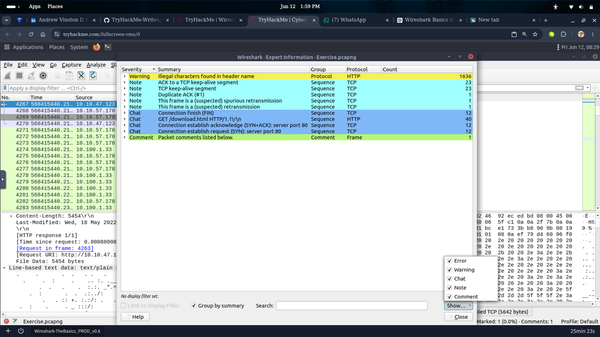
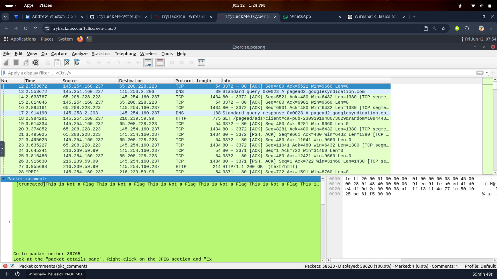

# Wireshark: The Basics — SOC Lab Writeup

   

> **Key finding:** Never assume protocol content without reading the full response body. Packet 12 was a deliberate decoy. The real answer was buried much later in the capture.

---

## Overview

Wireshark is a network protocol analyzer used by SOC analysts to capture and analyze network traffic in real time. This writeup documents my hands-on investigation from completing TryHackMe's **Wireshark: The Basics** room, including the mistakes I made, what I found, and why it matters in a real SOC context.

🔗 [Room Link](https://tryhackme.com/room/wiresharkthebasics)

---

## What I Actually Found

| Investigation | Finding |
|---|---|
| HTTP stream content | Response body was **XML**, not HTML — only visible after scrolling the full stream |
| Packet 12 comment | Deliberate decoy — `"This_is_Not_a_Flag"` repeated 100 times |
| File integrity | MD5 hash verified successfully via Linux terminal |
| Exported object | File extracted from HTTP traffic using Export Objects |
| Case sensitivity | `desktop/exercise.pcapng` failed — correct path was `Desktop/exercise.pcapng` |

---

## Challenges & Real Lessons

**1. Linux is case-sensitive**
Typed `desktop/exercise.pcapng` → `No such file or directory`.
Correct path: `Desktop/exercise.pcapng`. In a real SOC, wrong paths waste time during active incidents.

**2. Don't assume protocol content**
Was 100% sure the markup language in the HTTP response was HTML. It was XML — visible only at the bottom of the stream after scrolling. Lesson: read everything, scroll to the end.

**3. Decoy traps exist in real investigations**
Packet 12 had `"This_is_Not_a_Flag"` repeated 100 times. Real clue was buried later. Attackers use noise to hide real artifacts. Slow down, don't anchor on the first thing you see.

---

## Hands-On Activities

### Packet Analysis
- Investigated protocol layers across multiple packets
- Navigated large captures using packet numbers and display filters (`http`, `tcp`)
- Analyzed packet metadata and embedded comments
- Located hidden clues within thousands of packets

### HTTP Traffic Investigation
- Examined HTTP requests and full response bodies
- Identified XML content initially misread as HTML
- Exported transferred objects from captured traffic

### File Integrity Verification
- Generated and verified MD5 hashes using `md5sum` in Linux terminal
- Compared hashes for integrity validation
- Reviewed SHA256 values from capture file properties

### Wireshark Features Used
- Expert Information Window
- Packet Comments
- Export Objects (HTTP)
- HTTP Stream Following
- Capture File Properties

---

## SOC Analyst Relevance

| Skill Practiced | SOC Application |
|---|---|
| PCAP analysis | Investigating network-based alerts |
| HTTP stream inspection | Detecting data exfiltration or C2 traffic |
| File hash verification | Malware artifact integrity checking |
| Filtering large captures | Triaging alerts efficiently under pressure |
| Reading full response bodies | Avoiding false assumptions during investigation |

---

## Screenshots

### Completion


### Expert Information Window


### MD5 Hash Verification


### HTTP Export Objects


### Capture File Properties (SHA256)


### Packet 12 — Decoy Trap


---

## Tools Used

```
Wireshark | Linux Terminal | md5sum
```

---

## Key Takeaways

- Real packet captures are noisy — filtering and patience are the actual skills
- Never anchor on the first finding — read the full stream
- File integrity verification is a standard step in SOC investigations
- Case sensitivity in Linux matters during live incident response
- Wireshark's Export Objects is a powerful feature for recovering transferred files

---

*Part of my [TryHackMe SOC & Blue Team writeups](https://github.com/andyydz/TryHackMe-Writeups) series.*
